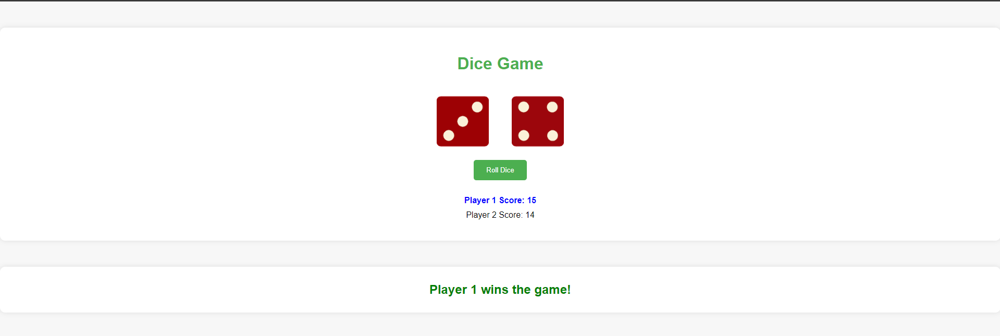

## Assignment 7 and 8 

### Question:

You have two dices and a button. When you click on the button you randomly change the dice images and the score of each player is changed according to the difference between the dices. When a player reaches a specific number, that player will be announced as winner.

## Output

